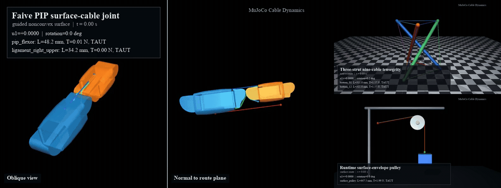

# MuJoCo Cable Dynamics

[中文说明](README_zh.md) | [Project page](https://mujocable.github.io/) |
[Selected demos](docs/DEMO_CATALOG.md)

A standalone C++ MuJoCo engine plugin for massless, unilateral cables routed
over cylinders and closed mesh surfaces. The plugin computes runtime cable
length, free length, tension, surface contact points, and rigid-body forces
without discretizing the cable into rigid links.



*MuJoCo rollouts of the Faive PIP surface-cable joint (left), three-strut
tensegrity (upper right), and runtime surface-envelope pulley (lower right).*

## Capabilities

- tension-only Kelvin-Voigt cable law with slack, pretension, damping, and a
  maximum-tension limit;
- direct contraction, spool-angle, spool-velocity, and physical spool-joint
  control;
- signed stored winding length and optional spool reaction torque;
- analytic cylinder envelopes and homotopy-guided routes on closed convex or
  nonconvex mesh obstacles;
- compound routing over moving surfaces with a common-tangent interface;
- optional Euler-Eytelwein/Capstan segment-tension propagation;
- passive ligaments, active cables, live sensors, and standard MuJoCo scene
  visualization;
- route, constitutive, and rendering hysteresis for reduced switching jitter.

The intended domain is quasi-static and low-frequency cable-driven mechanisms
where cable mass, sag, bending, torsion, wave propagation, and self-contact can
be neglected.

## Native MuJoCo Tendon Comparison

MuJoCo spatial tendons remain the preferred choice for ordinary fixed routing
through sites and supported wrap objects. This plugin adds behavior needed by
the included mechanisms:

| Capability | Native tendon | This plugin |
|---|---:|---:|
| Tension-only slack law | Requires model-specific setup | Built in |
| Runtime free-length control | Limited | Built in |
| Physical spool angle and reserve | No direct cable state | Built in |
| Closed-mesh obstacle routing | Limited | Convex and guided nonconvex routes |
| Compound moving-surface route | Limited | Common-tangent route state |
| Route validity and residual sensors | No | Yes |

Demo 17 and Demo 18 provide a matched plugin/native tensegrity comparison.

## Quick Start: Binary Release

Binary bundles are built for the operating systems listed on the
[Releases](https://github.com/MuJoCable/mujoco-cable-dynamics/releases) page.
They are linked against MuJoCo `3.4.x`; install a matching Python runtime first:

```bash
python3 -m venv .venv
source .venv/bin/activate
python -m pip install "mujoco>=3.4,<3.5" numpy
```

Download and extract the archive for your operating system and CPU, then run:

```bash
cd mujoco-cable-dynamics-v0.1.0-<platform>-<architecture>
./scripts/run_demo.sh 15 --show-route-debug --duration 120
```

On macOS the launcher uses `mjpython`, which is required by the passive MuJoCo
viewer. On Linux it uses `python3`. A release archive is portable within the
same operating-system, architecture, and MuJoCo `3.4.x` ABI family; it is not a
fully static application bundle.

## Build From Source

### 1. Clone and install the runtime

```bash
git clone https://github.com/MuJoCable/mujoco-cable-dynamics.git
cd mujoco-cable-dynamics

python3 -m venv .venv
source .venv/bin/activate
python -m pip install --upgrade pip
python -m pip install -e .
```

### 2. Configure and build

```bash
MUJOCO_DIR="$(python -c 'import pathlib, mujoco; print(pathlib.Path(mujoco.__file__).resolve().parent)')"
cmake -S . -B build \
  -DCMAKE_BUILD_TYPE=Release \
  -DMUJOCO_PYTHON_PACKAGE_DIR="$MUJOCO_DIR"
cmake --build build --config Release
```

The output is normally:

- macOS: `build/plugin/libcable_unilateral.dylib`
- Linux: `build/plugin/libcable_unilateral.so`

### 3. Run a model

```bash
# macOS
./scripts/run_demo.sh 15 --show-route-debug --duration 120

# Linux uses python3 automatically
./scripts/run_demo.sh 17 --show-cable-state --duration 120
```

You can also invoke the viewer directly:

```bash
mjpython scripts/view_cpp_plugin_demo.py \
  --plugin build/plugin/libcable_unilateral.dylib \
  --model cable_plugin_demos/25_faive_index_pip_surface_cable.xml \
  --show-route-debug --show-cable-state --duration 120
```

## Selected Demos

Only demos shown on the academic project page are included here.

| Group | Demos | Contents |
|---|---|---|
| Pulleys | 09, 10, 11, 12, 15, 21 | drum wrapping, dual pulleys, reserve, friction, wheel-and-axle |
| Rolling/compliant joints | 13, 14, 16, 20 | cylinder, convex mesh, passive and controlled saddle joints |
| Tensegrity | 17, 18, 19 | plugin/native baseline and mixed stiffness/slack |
| Faive PIP | 24, 25 | virtual-hinge baseline and free-body surface cable |

See [the demo catalog](docs/DEMO_CATALOG.md) for exact model names.

## MJCF Interface

Load the shared library before compiling an MJCF model:

```python
from pathlib import Path
import mujoco

mujoco.mj_loadPluginLibrary(str(Path("libcable_unilateral.dylib").resolve()))
model = mujoco.MjModel.from_xml_path("model.xml")
```

Minimal native-tendon configuration:

```xml
<extension>
  <plugin plugin="mujoco.cable.unilateral">
    <instance name="cable">
      <config key="route_mode" value="native"/>
      <config key="home_length" value="auto_initial"/>
      <config key="stiffness" value="1200"/>
      <config key="damping" value="2"/>
      <config key="slack" value="0.0002"/>
      <config key="max_tension" value="80"/>
      <config key="ctrl_mode" value="target_contraction"/>
    </instance>
  </plugin>
</extension>
```

Surface routes use a force-disabled seed tendon. The first `site user` slot has
the following meaning:

- `user="1"`: physical endpoint;
- `user="2"`: initialization route hint, ignored as a runtime force node;
- `user="3"`: physical guide that remains in the runtime route;
- `user="0"`: no plugin role.

```xml
<size nuser_site="1"/>
<tendon>
  <spatial name="route_seed" width="0.000000001">
    <site site="start"/><site site="hint_a"/>
    <site site="hint_b"/><site site="end"/>
  </spatial>
</tendon>

<config key="route_mode" value="surface"/>
<config key="mesh_route_mode" value="guided_surface"/>
<config key="route_tendon" value="route_seed"/>
<config key="wrap_geoms" value="surface_a surface_b"/>
```

`wrap_geoms` must correspond one-to-one with role-2 hints. A surface-mode plugin
actuator must use `gear="0"`, because the plugin applies forces along the solved
surface route directly.

The 12-value plugin sensor reports:

```text
length, velocity, free_length, contraction, extension, tension,
taut, saturated, route_status, tangent_residual,
surface_residual, solver_iterations
```

## Validation

```bash
export CABLE_PLUGIN_LIBRARY="$PWD/build/plugin/libcable_unilateral.dylib"  # use .so on Linux
python -m unittest discover tests
python scripts/smoke_cpp_plugin.py \
  --plugin "$CABLE_PLUGIN_LIBRARY" \
  --model cable_plugin_demos/15_cpp_plugin_surface_single_pulley.xml
```

The tests cover the unilateral law, cylinder geometry, compound routes,
convex/nonconvex mesh routing, pulleys, saddle joints, tensegrity, the Faive PIP
comparison, and repository path portability.

## Creating a Release Bundle

```bash
./scripts/package_release.sh build/plugin/libcable_unilateral.dylib dist
```

Pushing a tag such as `v0.1.0` runs the GitHub Actions release workflow, builds
platform bundles, generates SHA-256 files, and attaches them to a GitHub
Release.

## Limitations

- The cable is massless and has no sag, bending, torsion, wave propagation, or
  cable-cable self-contact.
- Mesh routes preserve an initialized homotopy/corridor and do not globally
  switch sides during simulation.
- Nonconvex routing requires closed, consistently oriented, non-self-
  intersecting obstacle meshes.
- Rolling-joint demos do not yet impose a complete rope/surface no-slip velocity
  constraint.
- In the current Faive PIP regression, the faceted two-surface bridge remains
  collision-free but reaches a worst-case interface tangent mismatch of about
  21.2 degrees. Treat Demo 25 as a research comparison, not a hardware-validated
  digital twin.
- Binary releases must match the target operating system, CPU architecture, and
  MuJoCo ABI.

## License

Code is distributed under Apache License 2.0. See [LICENSE](LICENSE) and
[THIRD_PARTY_NOTICES.md](THIRD_PARTY_NOTICES.md) for asset attribution.
