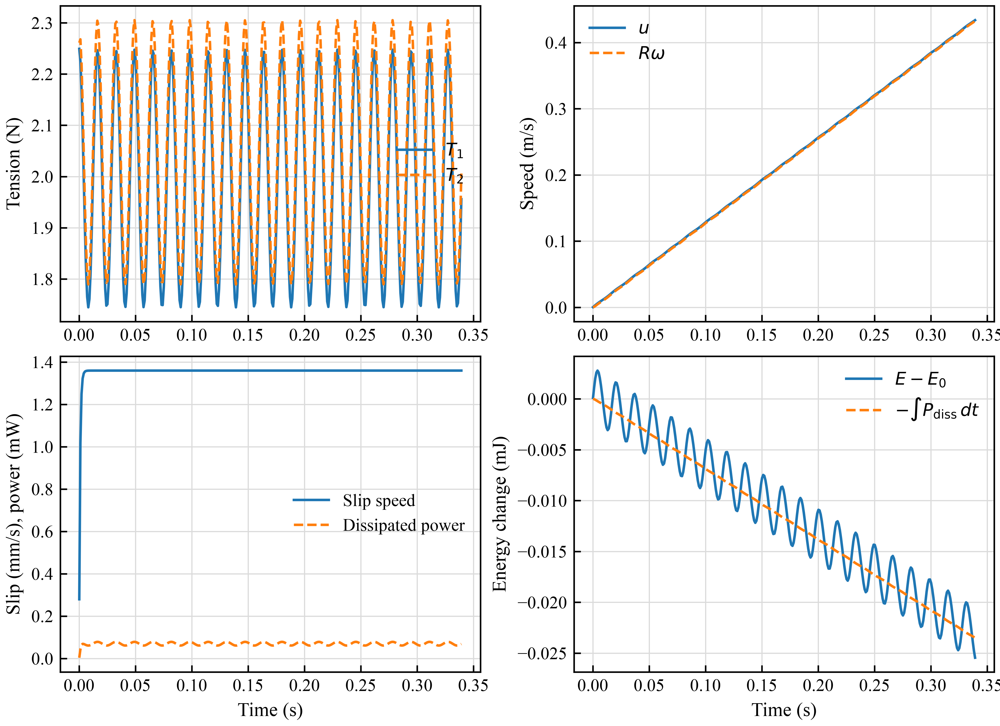

# Demo 29: Free Rotating Inertial Pulley

Demo 29 isolates cable-surface friction on a pulley with a fixed axle position
and a free rotational degree of freedom. The pulley is not motorized. A mass
difference between two vertical sliders transports the cable and friction
accelerates the pulley.

## Run

```bash
./scripts/run_demo.sh 29 --show-route-debug --show-cable-state --duration 30
```

Run the quantitative validation and regenerate CSV, JSON, PDF, SVG, and 600 dpi
PNG outputs:

```bash
python scripts/analyze_free_rotating_pulley.py \
  --plugin build/plugin/libcable_unilateral.dylib --strict
```

Use `libcable_unilateral.so` on Linux.

## Model

- Pulley radius: `0.05 m`.
- Pulley generalized hinge inertia: `1.0e-4 kg m^2`.
- Left and right slider masses: `0.18 kg` and `0.24 kg`.
- Cable stiffness: `15000 N/m`; cable damping: `0 N s/m`.
- Friction coefficient: `0.12`; regularization speed: `0.020 m/s`.
- Upper wrap angle: approximately `pi rad`.

The endpoint x coordinates coincide with the two vertical pulley tangents.
Consequently, the cable contributions to the two slide generalized forces are
the two segment tensions without a projection correction.

## Velocity-directed friction

The plugin estimates the cable material speed from the endpoint velocities and
computes the pulley surface speed at every route node. For slip speed
`v_slip = u - R omega`, the regularized exponent is

```text
T2 / T1 = exp(mu theta tanh(v_slip / v0)).
```

This changes friction direction automatically when relative sliding reverses
and makes the tension difference continuous at zero slip. It is a kinetic
regularization, not a static-friction complementarity constraint. In the
current beta this mode is restricted to passive surface cables: actuator-driven
material transport has not yet been added to the endpoint speed estimator.

The validation independently checks

```text
tau = R (T2 - T1),
I alpha = tau,
P_diss = -[(T1 - T2) u + tau omega] >= 0.
```

## Current result

For a `0.34 s` RK4 rollout at a `0.2 ms` step:

- peak tension difference: `0.0576 N`;
- peak pulley angular velocity: `8.65 rad/s`;
- p95 absolute slip speed: `1.36 mm/s`;
- p95 Capstan-ratio relative error: `2.69e-4`;
- p95 torque relative error: approximately machine precision;
- minimum dissipated power: `6.08e-5 W`;
- cumulative friction dissipation: `2.35e-5 J`;
- energy-balance residual: `3.01e-6 J`, or `12.8%` of the small accumulated
  friction loss.

The last value is reported separately as integration and route-velocity
residual; it is not counted as physical friction.



# Demo 29：自由转动惯性滑轮

该示例将滑轮轴的位置固定，但保留滑轮绕轴自由转动的 hinge。滑轮没有电机，左右
滑块的质量差驱动绳索运动，绳面摩擦产生滑轮转矩。

XML 使用：

```xml
<config key="capstan_mu" value="0.12"/>
<config key="capstan_direction" value="velocity"/>
<config key="capstan_velocity_scale" value="0.020"/>
```

`velocity` 模式根据绳材速度和轮缘速度之差自动决定摩擦方向。它能够在反向滑动时
自动反转张力传播方向，并保证零滑移附近连续，但仍属于正则化动摩擦，不是带历史
状态的严格静摩擦或无滑移约束。当前 beta 仅允许无 plugin actuator 的被动 surface
cable；卷扬驱动的材料输运速度尚未进入端点速度估计器。

打开仿真：

```bash
./scripts/run_demo.sh 29 --show-route-debug --show-cable-state --duration 30
```

重新生成定量结果：

```bash
python scripts/analyze_free_rotating_pulley.py \
  --plugin build/plugin/libcable_unilateral.dylib --strict
```

验证脚本直接从左右 slide 的 `qfrc_passive` 读取两侧张力，从 pulley hinge 读取
转矩、角速度和角加速度，并检查 Capstan 张力比、转动惯量方程、绳速/轮缘速度、
摩擦功率符号及能量变化。下一阶段的孔口和非规则 mesh 摩擦应复用这一能量与速度
验收框架，同时增加每个包络面的独立摩擦系数和静动摩擦切换。
