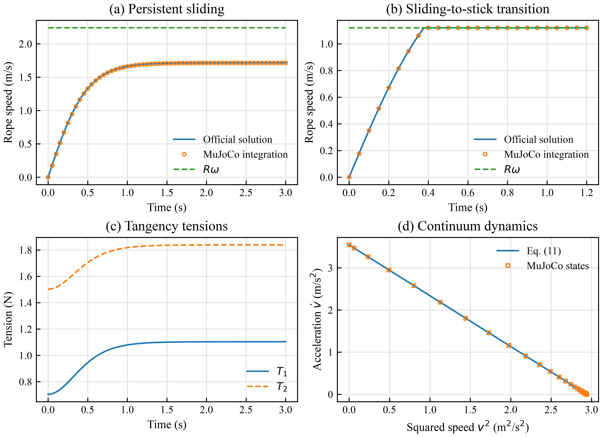

# Demo 30: CPhO 2018 Massive Rope on a Rough Pulley

This benchmark reproduces problem 3 of the 35th Chinese Physics Olympiad
(2018) final theory examination. It is also an explicit boundary test for
MuJoCable: the competition problem uses a massive material rope, while the
current plugin cable is massless.

The proposed massive-cable architecture is archived in
[`MASSIVE_CABLE_FUTURE_EXTENSION.md`](MASSIVE_CABLE_FUTURE_EXTENSION.md).
It is intentionally deferred and is not part of the current plugin API.

## Problem model

An inextensible rope of linear density `lambda` passes over the upper half of
a pulley of radius `R`. The pulley axis is at height `L`. Both vertical rope
segments retain length `L`: material is continuously lifted from the right
floor pile and deposited into the left pile. The pulley rotates at prescribed
angular speed `omega`, and the kinetic rope/pulley friction coefficient is
`mu`.

The official variable-mass balances for the two vertical segments are

```text
-T1 + lambda L g = lambda L dv/dt,
 T2 - lambda v^2 - lambda L g = lambda L dv/dt.
```

The `lambda v^2` term is the momentum flux required to pick stationary rope up
from the floor. For a pulley contact coordinate `phi` from `0` to `pi`, the
official distributed contact equations are

```text
dT/dphi + mu N R - lambda R g cos(phi) = lambda R dv/dt,
T - N R + lambda R g sin(phi) = lambda v^2.
```

After eliminating `N` and integrating over the half wrap, equations (9)-(11)
of the official solution give

```text
A - E v^2 = B dv/dt,

E = exp(mu pi),
A = L g (E - 1) + R g [2 mu/(1 + mu^2)] (E + 1),
B = L (E + 1) + (R/mu) (E - 1).
```

While the rope is sliding,

```text
v(t) = v_s tanh(t/tau),
v_s = sqrt(A/E),
tau = B/sqrt(AE).
```

The complete maximum-speed result is therefore

```text
v_max = min(R omega, v_s).
```

If `R omega < v_s`, sliding ends at

```text
t_stick = tau atanh(R omega / v_s).
```

The later unequal tensions remain admissible because static friction supplies
an interval, rather than enforcing the kinetic Capstan equality.

## MuJoCo implementation boundary

The MJCF contains a unit-generalized-mass transport coordinate. The analysis
script applies `(A - E v^2)/B` through `qfrc_applied`, so MuJoCo integrates the
official continuum equation and provides the visual scene and simulation
clock.

This is deliberately **not** implemented with the current MuJoCable
constitutive law. A massless elastic cable cannot generate:

- the floor pickup/deposition momentum flux `lambda v^2`;
- tangential inertia `lambda R dv/dt` on the wrapped arc;
- centripetal loading `lambda v^2` in the contact normal force;
- gravity distributed along the moving rope;
- a material-transport state independent of geometric route length.

Consequently, Demo 30 is a reference benchmark for a future massive-cable
extension, not evidence that the current plugin already supports rope mass.
The native spatial tendon in the XML is visual only.

## Numerical instance and result

The supplied instance uses

| Parameter | Value |
|---|---:|
| `lambda` | `0.25 kg/m` |
| `R` | `0.08 m` |
| `L` | `0.45 m` |
| `mu` | `0.25` |
| `g` | `9.81 m/s^2` |
| Time step | `0.0002 s` |

Two branches are checked:

| Branch | `omega` | Official result | MuJoCo result |
|---|---:|---:|---:|
| Persistent sliding | `28 rad/s` | `v_max = 1.7144867 m/s` | `1.7144727 m/s` at `3 s` |
| Sliding to stick | `14 rad/s` | `v_max = R omega = 1.12 m/s` | `1.12 m/s` |

For the stick-limited case, the official transition time is `0.3777383 s`; the
time-stepped model detects `0.3778000 s`, a `61.7 microsecond` error. The
maximum transient speed error against the closed-form trajectory is
`1.30e-4 m/s`. Equation (11) closes to `4.44e-16 m^2/s^2`, and the integrated
wrapped-contact tension relation closes to `1.11e-15 N`.



## Run

Generate the CSV, JSON, PDF, SVG, and 600 dpi PNG comparison:

```bash
conda run -n rope_plugin python scripts/analyze_cpho_2018_problem3.py --strict
```

View the persistent-sliding branch on macOS:

```bash
conda activate rope_plugin
mjpython scripts/view_cpho_2018_problem3.py \
  --case sliding --duration 120
```

View the sliding-to-stick branch:

```bash
mjpython scripts/view_cpho_2018_problem3.py \
  --case stick --duration 120
```

The yellow markers show material transport. The geometric rope remains in the
same place because the two tangent points and both vertical segment lengths are
fixed in the original problem.
