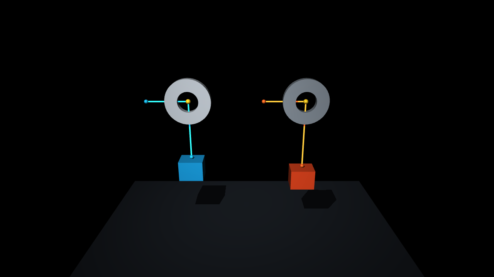

# Demo 31-32: rigid flex 真孔与解析孔口摩擦

这两个最小示例把“孔的碰撞几何”和“绳穿孔后的摩擦传力”分开验证。

## Demo 31：普通 mesh 与 rigid flex

`31_rigid_flex_through_hole.xml` 将同一个闭合 washer 网格并排加载两次：

- 左侧使用普通 `geom type="mesh"`。画面显示孔，但 MuJoCo 碰撞使用凸包，小球被不可见的孔盖挡住。
- 右侧使用 `flexcomp type="mesh" rigid="true"`。三角面非凸碰撞保留孔，小球穿孔后落到地面。

washer 是闭合、流形、亏格为 1 的低面数网格，由
`scripts/generate_eyelet_demo_assets.py` 确定性生成。真实机器人可以把 STL/OBJ
导入 rigid flex，因此 rigid flex 需要孔已经存在于网格；它不会从一个实心 STL
自动推断或切出孔。

rigid flex 只解决碰撞几何。当前 MuJoCable 绳是一条无厚度的路径和力学模型，不是
由 capsule 组成的碰撞绳，所以仅把机器人 STL 改成 rigid flex 并不会自动产生孔口
摩擦。


## Demo 32：不依赖 STL 的解析 eyelet

`32_cpp_plugin_eyelet_friction.xml` 使用 role-3 site 表示理想导眼。新增的可选配置

```xml
<config key="guide_friction_mu" value="0.45"/>
```

只对 role-3 guide 的局部转角传播张力。给定相邻自由绳段方向，转角为

```text
theta = acos(t_in dot t_out).
```

在 `capstan_direction="forward"` 的滑动近似下，插件使用

```text
T_out = T_in exp(-guide_friction_mu * theta).
```

同时按照不等的两侧张力向 guide 所属刚体施加合力。该模型不需要 STL，也不要求
孔壁参与通用碰撞；只需要孔中心 site 随所属 body 运动。

示例中两个 `0.12 kg` 负载具有相同绳长、刚度和初始上游张力。经过 `2 s`：

| 系统 | 摩擦系数 | 转角 | 上游张力 | 下游张力 | 负载位移 |
|---|---:|---:|---:|---:|---:|
| 光滑 guide | `0` | `90 deg` | `1.1763 N` | `1.1763 N` | `+16.47 mm` |
| 粗糙 eyelet | `0.45` | `90 deg` | `2.3931 N` | `1.1802 N` | `-7.86 mm` |

粗糙孔口的理论和实测张力比均为 `2.0276112`。两侧下游张力最终都收敛到负载
重力约 `1.1772 N`，但孔前所需张力和负载平衡位置不同。



## 打开 Demo

构建插件：

```bash
conda run -n rope_plugin cmake -S . -B build \
  -DMUJOCO_PYTHON_PACKAGE_DIR=[path-to-python-mujoco-package]
conda run -n rope_plugin cmake --build build -j4
```

macOS：

```bash
conda activate rope_plugin

mjpython scripts/view_eyelet_demos.py --demo flex --duration 120

mjpython scripts/view_eyelet_demos.py \
  --demo friction \
  --plugin build/plugin/libcable_unilateral.dylib \
  --duration 120
```

统一启动器：

```bash
./scripts/run_demo.sh 31 --duration 120
./scripts/run_demo.sh 32 --duration 120
```

数值验收：

```bash
conda run -n rope_plugin python scripts/analyze_eyelet_friction.py \
  --plugin build/plugin/libcable_unilateral.dylib --strict
```

## 简单应用

该降阶孔口模型适合：

- SpiRobs 和连续体机器人的串联穿绳孔；
- 机械手指中的 tendon guide 和 ligament eyelet；
- Bowden cable 的入口、出口导向；
- 起重索具中的固定导眼和 fairlead；
- 缝纫机、纺织机构和钓竿导环中的逐孔张力损失。

## 当前限制

- `guide_friction_mu` 是点式 Capstan 滑动近似，没有孔径、孔长和圆角参数。
- 多个 guide 可以串联，但每个插件实例当前共用同一个 `guide_friction_mu`。
- `forward/reverse` 由用户指定滑动方向；`velocity` 是连续正则化动摩擦，不是完整静摩擦互补求解。
- 不表示孔内壁分布压力、绳直径、磨损、温升或 TPU 黏弹性。
- 若孔径、孔长或入口圆角显著影响接触角，应升级为入口圆角、孔壁和出口圆角组成的解析 eyelet route。
- 若研究绳与真实孔壁的碰撞、自卡滞或脱孔，需要 rigid flex/非凸碰撞几何与有厚度绳模型，不能只使用 role-3 guide。
