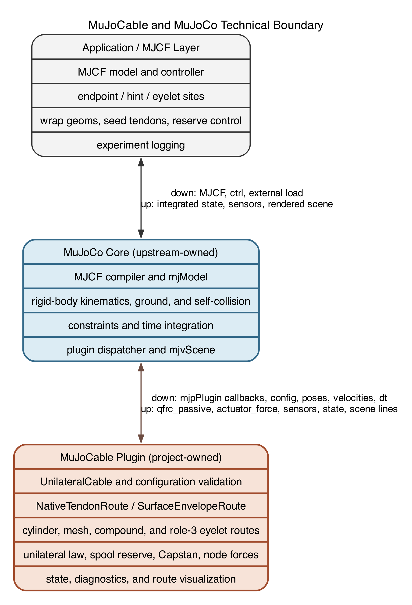
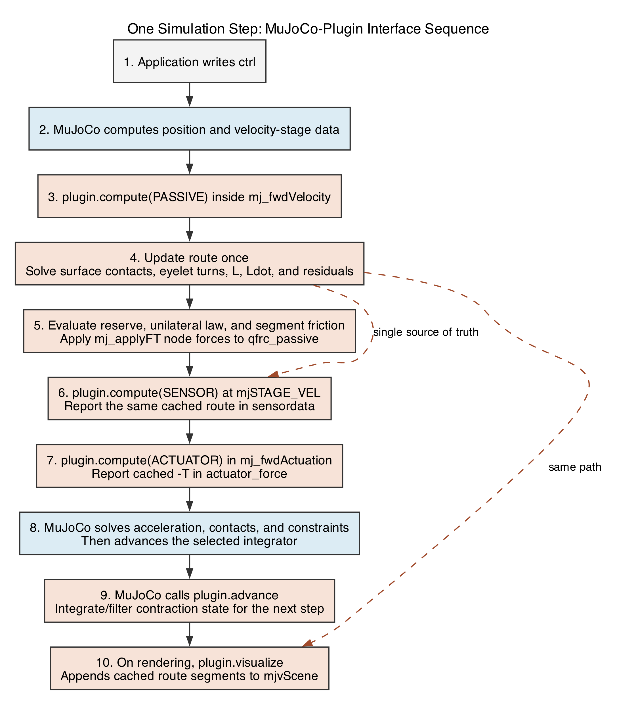
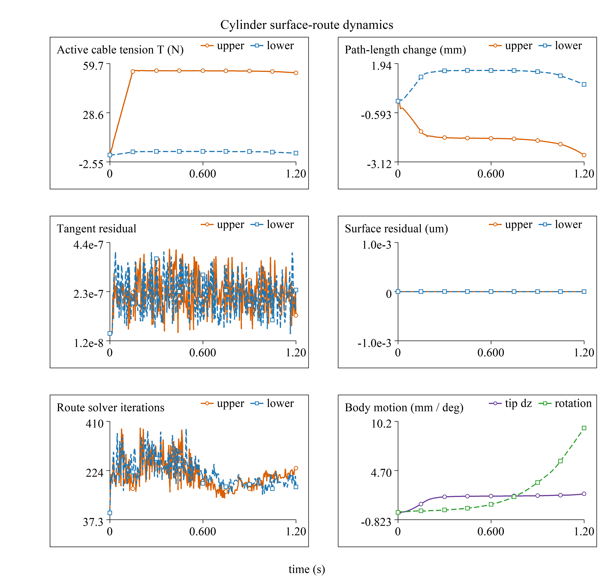
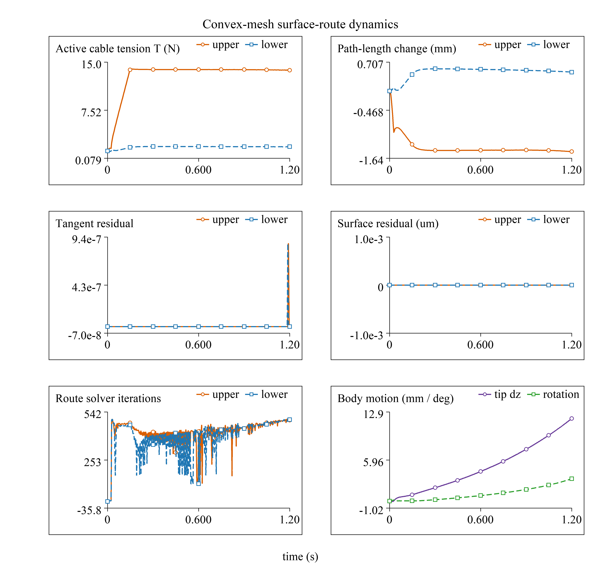
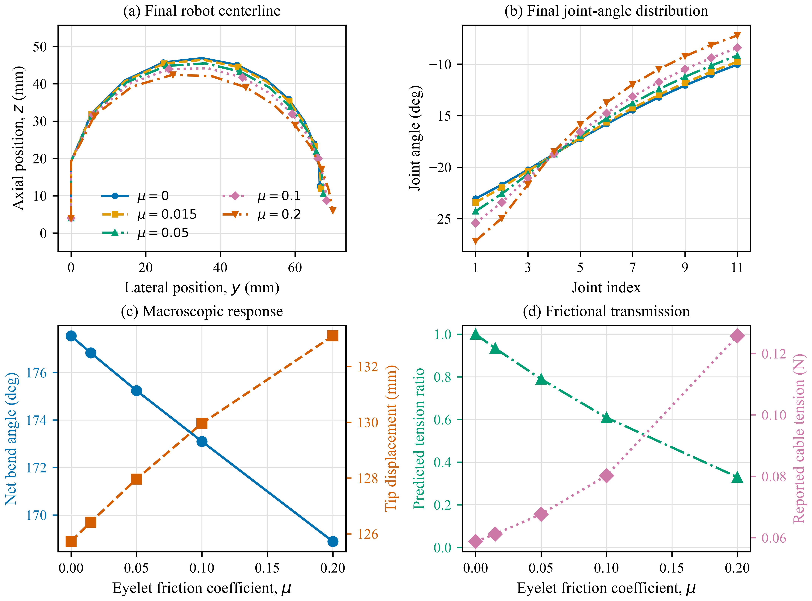

# MuJoCo 绳索插件方法与实现策略报告

版本：2026-08-06

## 摘要

本项目实现 `mujoco.cable.unilateral`，定位为用于滑轮、卷线轴、张拉结构、滚动关节和多指机构的 **physics-informed massless cable surrogate**。它不是具有质量、弯曲、扭转和自碰撞状态的完整绳体求解器，也不替代 MuJoCo 的刚体、接触、约束或积分器。

插件保留默认 `route_mode="native"`，兼容已有 MuJoCo spatial tendon 模型；新增可选 `route_mode="surface"`。surface 模式把 `mid` site 降为一次性的同伦初始化提示，仿真运行时的绳长、速度、接触点、张力和刚体受力全部来自实时表面包络路径。当前支持任意姿态有限圆柱、闭合凸 mesh 和闭合非凸 mesh 上的受拉障碍路径，并在标准 MuJoCo scene 中直接绘制真实运行时绳路。

当前实现的核心能力如下。

- 单边拉力：松弛绳不产生推力。
- 可变自由长度、卷线速度、卷轴角度和预绕绳长。
- `NativeTendonRoute` 与 `SurfaceEnvelopeRoute` 两个路径后端。
- 任意姿态圆柱的切线和螺旋测地线包络。
- 闭合凸 mesh 的固定同伦 triangle-strip 路由。
- 闭合非凸 mesh 的 BVH 无穿透、活动接触和凹槽跨越路径。
- 表面路径直接施加到端点和包络刚体，避免 seed tendon 重复施力。
- 无摩擦等张力和可选 Euler-Eytelwein/Capstan 分段张力传播。
- role-3 孔口的局部 Capstan 摩擦、双侧卷绳余量和拮抗差动收放。
- 12 维 surface 诊断传感器和标准 viewer `visualize` 回调。
- 双圆柱和异形凸 mesh 滚动关节示例、验收脚本和截图流程。
- 无 actuator 的被动柔顺韧带，以及包络同形无自交非凸马鞍 STL 的被动/受控示例。
- 100_fingers human 参数手的 20 自由度、25 条表面路由整手集成示例。
- 以正式插件回调为边界的 MuJoCo 集成：路径和绳索物理由插件负责，刚体状态推进仍由 MuJoCo 负责。

## 1. 问题与范围

MuJoCo spatial tendon 可以表达由 site、sphere/cylinder wrap geom 和 pulley 元素组成的路径，并提供路径长度、速度、Jacobian 和 actuator transmission [1]-[4]。它适合路径拓扑已由 MJCF 明确给出的机构。

滚动手指和复杂绕线机构还需要以下能力。

1. `mid` 只告诉求解器初始绕行侧，不应成为永久固定导向点。
2. 绳路必须在移动刚体表面重新求切线和测地线，而不能穿透几何。
3. 主动绳索必须改变自由长度，同时保持单边张力。
4. surface 模式不能再让 MuJoCo 沿 seed tendon 施加第二套力。
5. 接触路径、残差和失败状态必须可测试、可视化和可记录。

第一阶段支持任意姿态圆柱和双圆柱滚动关节。第二阶段支持闭合、流形的凸 mesh；当前扩展进一步支持闭合非凸 mesh 上固定初始化侧的受拉无穿透路径。孔洞、自动换侧、绳质量、弯曲、扭转、自接触和完整 stick-slip 历史仍不在当前范围内。

需要严格区分表面包络与无滑移滚动约束。当前实现能计算绳索在圆柱/凸代理面上的切线路径、张力和刚体节点力，但还没有绳索材料速度与轮面切向速度相等的约束，也没有由滑轮转动惯量决定的两侧张力差。因此 Demo 13 和 Demo 14 是 physics-informed rolling-constraint surrogate，不应解释为完整的有限惯量滚动关节。Demo 15 使用固定导向滑轮，单独验证当前已经闭合的几何与受力部分。

## 2. XML 接口

### 2.1 Site 角色

surface 模式使用 `site user` 指定语义角色：

```xml
<size nuser_site="1" />

<site name="start" user="1" />
<site name="hint_prox" user="2" />
<site name="hint_dist" user="2" />
<site name="end" user="1" />
```

角色定义如下。

- `user="1"`：两个真实固定端点，只允许出现在 seed tendon 的首尾。
- `user="2"`：初始化 route hint，运行时不作为路径节点或受力节点。
- `user="3"`：真实 guide，运行时路径必须经过。
- `user="0"`：无插件语义，不能出现在 surface seed tendon 中。

MuJoCo 要求 spatial tendon 的 `width` 为正，因此不可使用计划草案中的 `width="0"`。示例使用合法但不可见的 `width="1e-9"`：

```xml
<tendon>
  <spatial name="upper_route_seed" width="0.000000001"
           rgba="1 0.2 0.05 1">
    <site site="start" />
    <site site="hint_prox" />
    <site site="hint_dist" />
    <site site="end" />
  </spatial>
</tendon>
```

### 2.2 Surface 配置

```xml
<config key="route_mode" value="surface" />
<config key="mesh_route_mode" value="taut_obstacle" />
<config key="route_tendon" value="upper_route_seed" />
<config key="wrap_geoms" value="proximal_wrap distal_wrap" />
<config key="site_role_user_index" value="0" />
<config key="visual_width" value="2" />
<config key="route_hysteresis" value="0.00002" />
<config key="visual_smoothing_timeconstant" value="0.025" />
```

`wrap_geoms` 与 role-2 hint 一一对应。相同 geom 可以重复列出。初始化后，hint 的位置不再进入路径长度、速度或受力计算。

主动 surface 绳索仍使用 plugin actuator 作为控制和张力报告接口，但 transmission 必须为零：

```xml
<plugin name="upper_drive" tendon="upper_route_seed" gear="0"
        instance="upper_cable" />
```

插件把 surface 路由力写入 `qfrc_passive`，并把 `actuator_force=-T` 用作报告值。`gear="0"` 保证 seed tendon 不会通过原生 transmission 再施加一遍力。没有 actuator 的 surface instance 表示被动绑带。

## 3. 软件架构、技术边界与双路径后端

### 3.1 NativeTendonRoute

`NativeTendonRoute` 读取 MuJoCo 已编译 spatial tendon 的：

```text
L = data.ten_length[tendon_id]
Ldot = data.ten_velocity[tendon_id]
```

路径、wrap points 和 generalized force transmission 继续由 MuJoCo 原生实现负责。`route_mode` 缺省为 `native`，因此已有 XML、传感器维度和测试保持兼容。

### 3.2 SurfaceEnvelopeRoute

`SurfaceEnvelopeRoute` 自行维护：

- seed site 及角色；
- wrap geom 顺序；
- 圆柱绕行分支或 mesh triangle strip；
- 上一步接触点和优化参数；
- 实时路径点、长度、速度和残差。

初始化阶段使用 hint 选择绕行同伦类。运行时只读取真实端点、真实 guide、wrap geom 姿态和刚体速度。

### 3.3 与 MuJoCo 的技术分界线

插件注册名为 `mujoco.cable.unilateral`，能力标志为
`mjPLUGIN_PASSIVE | mjPLUGIN_ACTUATOR | mjPLUGIN_SENSOR`，传感器需求阶段为
`mjSTAGE_VEL`。这组接口定义了明确的软件所有权边界。

- **模型编译。** MuJoCo 负责 MJCF 解析、对象 ID、body/site/geom/tendon/actuator
  拓扑和参数存储。MuJoCable 读取并验证插件配置、site 角色、seed tendon、wrap geom
  顺序和 surface 模式的 `gear=0`。
- **运动学与几何。** MuJoCo 提供 body、site、geom 的世界位姿与速度，并在 native
  模式负责 tendon 路径、长度、速度和 moment arm。MuJoCable 在 surface 模式负责
  同伦初始化、圆柱/mesh 接触点、复合公切段、路径长度和路径速度。
- **动力学。** MuJoCo 负责质量矩阵、重力、碰撞接触、约束求解、广义加速度和时间
  积分。MuJoCable 负责单边绳本构、松弛/预紧/阻尼/饱和、Capstan 分段张力、卷轴
  长度映射和反扭矩。
- **力交换。** MuJoCo 提供 `qfrc_passive`、`actuator_force` 等标准数组并完成最终
  动力学求解。MuJoCable 通过 `mj_applyFT` 把端点和表面节点力累加到
  `qfrc_passive`，并在 `actuator_force` 中报告 `-T`。
- **状态与传感。** MuJoCo 管理 `plugin_state` 生命周期和 `sensordata` 存储。
  MuJoCable 保存收缩滤波/迟滞状态、缓存同一步路径，并写入 8/12 维 cable sensor。
- **可视化。** MuJoCo 分配、排序和渲染 `mjvScene`。MuJoCable 通过 `visualize`
  回调追加 `mjGEOM_LINE`，显示与动力学相同的缓存路径。

因此，surface cable 并不是 MuJoCo contact geom：插件没有把绳离散成碰撞体，也没有
向 MuJoCo 接触求解器注册“绳-面接触”。它在自己的几何求解器中计算质量为零的受拉
路径，再把等效节点力交给 MuJoCo。MuJoCo 随后将这些力与接触、重力、执行器和约束力
一起求解。插件不会直接写 `qpos`、`qvel` 或 `qacc`，不会改变模型拓扑，也不会绕过
MuJoCo 的积分器。

native 与 surface 模式的分界也不同。native 模式复用 MuJoCo 已有的
`ten_length`、`ten_velocity` 和 tendon transmission；surface 模式则隐藏 seed tendon，
令 actuator transmission `gear="0"`，由插件生成路径与 `qfrc_passive`，防止同一根绳
被原生 tendon 和插件重复施力。

### 3.4 插件接口和回调契约

1. **`init`：** 输入已编译 `mjModel` 和 instance ID；创建路由后端、验证配置并构建
   mesh 邻接/BVH。实例指针写入 `d->plugin_data[instance]`，错误返回 `-1`。
2. **`reset` / `copy` / `destroy`：** 按 MuJoCo data 生命周期重置可序列化状态、复制
   缓存或释放实例。
3. **`compute(PASSIVE)`：** 读取当前位姿、速度和控制状态，更新 surface route，计算
   本构和节点力；累加 `qfrc_passive` 并更新同一步 cache。无效路径本步为零力。
4. **`compute(ACTUATOR)`：** 读取同一步缓存，不重复求解 surface route；写
   `actuator_force=-T`，surface transmission 保持为零。
5. **`compute(SENSOR)`：** 读取 passive 阶段缓存且不重试失败路线；写 8 维 native
   或 12 维 surface `sensordata`，避免传感器掩盖本步动力学失败。
6. **`advance`：** 根据 `ctrl`、时间步和上一状态积分速度控制或更新命令低通/限速，
   写 `plugin_state` 供下一步使用。
7. **`visualize`：** 读取已求解路径和 `mjvScene`，可选只对显示做平滑，并追加装饰性
   线段；端点保持真实位置，不修改物理状态。

surface 模式在 `compute(PASSIVE)` 中只求解一次路线。ACTUATOR、SENSOR 和 viewer
均消费同一缓存，保证力、长度、诊断和显示具有同一个路径来源。若路线无效，插件保留
暖启动但不给当前步施力；传感器也报告该失败，而不是在稍后的阶段重新求路。

实现入口可以按以下文件定位：

| 文件 | 主要职责 |
|---|---|
| `plugin/register.cc` | 动态库载入时注册插件 |
| `plugin/unilateral_cable.cc/.h` | XML 属性、回调注册、本构、状态、力/传感器/可视化，以及可选实验性隐式算子 |
| `plugin/surface_route.cc/.h` | surface 路由状态、圆柱/mesh/复合表面求解和残差 |
| `cable_plugin_demos/*.xml` | 应用层 endpoint、hint、guide、wrap geom 与 actuator 配置 |

### 3.5 UML 组件图与单步时序

图 1 将应用/MJCF、MuJoCo 核心和 MuJoCable 插件分成三个所有权区域。蓝色区域是
MuJoCo 上游提供的编译、动力学与 scene 基础设施；橙色区域是本仓库实现。跨边界交换
的是已编译配置、运动学状态、广义力、插件状态、传感器值和可视化 primitive，而不是
第二套刚体求解器。

{width=60%}

矢量版本：[SVG](figures/mujocable_component_uml.svg)；[PDF](figures/mujocable_component_uml.pdf)。

图 2 给出常规 `mj_step` 中与本插件有关的时序。MuJoCo 在 velocity stage 内调用
passive 回调，插件完成路径和受力；随后 sensor 与 actuator 只读取缓存结果。积分结束后
`advance` 更新内部收缩状态，渲染回调在需要绘制 scene 时独立调用。

{width=66%}

矢量版本：[SVG](figures/mujocable_step_sequence_uml.svg)；[PDF](figures/mujocable_step_sequence_uml.pdf)。

可移植发布版只依赖标准 `mjpPlugin` 回调。`integration_mode="implicit_compliant"` 所用的
`mjpPluginImplicit` 是本项目在 MuJoCo 源码树中的实验接口，不属于当前官方稳定插件
ABI；因此 release 二进制的核心兼容性声明不得把该扩展算作 MuJoCo 原生能力。

## 4. 圆柱包络

### 4.1 数学基础

圆柱侧面展开到平面后，圆柱测地线变为直线 [5]。在圆柱局部坐标中，半径为 `r`，周向展开坐标为 `s=r*theta`，轴向坐标为 `z`。入口和出口间的表面段长度为：

```text
L_surface = sqrt((r * Delta theta)^2 + (Delta z)^2)
```

当 `Delta z=0` 时退化为圆弧；当 `Delta z!=0` 时为螺旋测地线。

外部点到圆截面的两个解析切点角为：

```text
theta_tangent = atan2(y, x) +/- acos(r / rho)
rho = sqrt(x^2 + y^2)
```

### 4.2 本项目实现

插件枚举入口和出口的解析切点候选，以及正向/反向展开角分支。初始化 hint 对候选周向弧施加同伦选择代价，固定 `branch_sign`。在每个候选分支内，只联合优化入口和出口轴向坐标：

```text
min L_free_in + L_surface + L_free_out
subject to -half_length <= z_in, z_out <= half_length
```

这样自由段严格与圆柱相切，不会通过圆柱内部；表面段允许任意姿态下的螺旋路径。若最优点触及有限圆柱端面，当前实现将残差标为 degraded，因为端面转接尚未实现。

圆柱候选枚举、hint 同伦固定、轴向优化、暖启动、多圆柱 Gauss-Seidel 耦合和离散可视化均为本项目自行实现。圆柱展开和切线公式是标准解析几何与微分几何结果 [5]。

## 5. Mesh 包络

### 5.1 Mesh 要求与几何分工

所有 surface mesh 首先必须是：

- 闭合；
- 每条边恰好邻接两个三角形；
- 无退化三角形；
- 绕序一致并能确定外法向；
- 无非相邻三角形自交。

`convex_surface` 进一步要求严格凸；`taut_obstacle` 和 `guided_surface` 允许非凸，
但仍固定初始化同伦侧并要求闭合无自交。显示 mesh、MuJoCo 碰撞 mesh 和 cable
route mesh 是三种职责，可以引用同一资产，也可以为性能和数值稳定性使用不同资产。
例如 Demo 14 使用显示面和低面数凸路由代理；Demo 16/20 的绳路使用实际闭合非凸
STL，而刚体接触仍使用低面数 contact patch。插件只对 `wrap_geoms` 指定的几何负责，
不会自动把所有可见或可碰撞 geom 当作绳索障碍物。

### 5.2 Triangle Strip 与优化

多面体表面最短路径可以通过展开相邻三角形处理；一般离散测地线问题可参考 Mitchell、Mount 和 Papadimitriou [6]。本项目采用受控的近似实现：

1. 把 hint 投影到最近三角面，得到 seed face。
2. 在 face dual graph 中建立经过 seed face 的入口到出口 triangle strip。
3. 固定该 strip 作为当前同伦类。
4. 把相邻三角面的公共边参数化为 `p_i(t_i)`。
5. 优化折线路径：

```text
min sum_i ||p_(i+1) - p_i||
subject to 0 <= t_i <= 1
```

6. 初始化使用 BFGS 与坐标黄金分割搜索；运行时复用 strip 和跨边参数，只做少量暖启动迭代。

该方法不是 MMP 精确全局算法的完整实现。固定同伦类、dual-graph 走廊、跨边参数化、运行时暖启动和失败降级策略均为本项目自行实现。faceted proxy 上的 `tangent_residual` 表示跨边坐标收敛残差，不等同于光滑曲面的切向夹角。

对于类似滚动轮廓的长挤出代理，应提供靠近目标平面的中央三角形带，并把端面放得足够远，避免最短路径物理上从有限物体端面滑脱。

### 5.3 非凸受拉障碍路径

`mesh_route_mode="taut_obstacle"` 允许闭合、流形、绕序一致的非凸 mesh。初始化时将 hint 投影到 seed face，并在三角面 dual graph 上用 Dijkstra 搜索建立经过该侧的有向 corridor。运行时在 corridor 的公共边上维护暖启动参数和活动接触集合：

1. 使用 MuJoCo mesh ray query 检查 endpoint、接触点及相邻包络面之间的全部自由绳段；
2. 若跨越若干三角面的直线无穿透，则删除中间非必要接触，使绳索跨过凹槽；
3. 若自由段重新被遮挡，则恢复走廊内被跳过的边接触；
4. 保留 hint 选定 seed face 两侧的必要 transition，防止无原因换到另一绕行侧；
5. 初始化后对多个移动 mesh 做两次耦合暖启动迭代，更新相邻表面的入口/出口；高精度坐标搜索只在初始化和拓扑修复时执行。

该算法求指定初始化侧内的近似最短受拉路径，不是全局非凸测地线算法。它不会要求凹面对绳产生吸力，亦不自动跨越拓扑分支。`tangent_residual` 报告活动路径的受约束局部长度改进量，`surface_residual` 报告离面/穿透残差。初始化验证闭合、流形、退化面、体积和绕序，并构建三角形 AABB BVH，对不相邻三角面执行三角形相交测试。运行时跨面绳段还需满足入口/出口有向面法向的单边条件，并通过 MuJoCo mesh ray query 检查中间遮挡。

### 5.4 同伦引导的表面韧带路径

`mesh_route_mode="guided_surface"` 使用与 `taut_obstacle` 相同的闭合性、流形、
绕序、自交和无穿透检查。初始化时，hint 只选择 seed face 和 dual-graph corridor；
投影点不作为运行时路径节点，hint site 不进入绳长、速度或受力。只保留 seed face
两侧的必要 transition，其余 transition 可在无穿透且满足单边接触时删除。

对于滚动关节，可选 `mesh_guide_axis` 以模型坐标指定滚动轴，并由
`mesh_guide_weight` 给偏离对应截面平面的 Dijkstra 边增加代价。这只约束初始化走廊
的选择，不把运行时接触点固定到平面；用于避免高分辨率异形 mesh 的图最短路横向
绕到竖直侧壁。

相邻 guided surface 进入复合状态后，求解器联合选择第一表面的离面点和第二表面的
着面点，最小化两侧表面弧长、有限自由段长度和切向 KKT 误差。自由段同时对两个 mesh
执行 ray 无穿透检查；切点以 mesh 局部坐标暖启动，局部窗口失配时同帧执行全局走廊
修复。该模式固定初始化同伦侧，因此不能解释为无条件全局最短路径。

## 6. 绳长、速度与刚体力

最终路径离散为真实 site 和表面接触点：

```text
p_0, p_1, ..., p_n
L = sum_i ||p_(i+1) - p_i||
```

对优化后的最短路径，包络定理允许忽略最优接触参数的一阶滑动项。插件使用每个节点所属刚体的点速度计算：

```text
Ldot = sum_i t_i dot (v_(i+1) - v_i)
```

其中 `t_i` 是第 `i` 段单位方向。该计算不对 hint 或接触点轨迹做有限差分。

单边本构模型为：

```text
L_free = L_home - contraction - pretension_offset
e = L - L_free - slack

if e <= 0:
  T = 0
else:
  T = clamp(k * e + c * Ldot, 0, T_max)
```

无摩擦时每段张力相等。节点合力为相邻绳段张力向量之和，并通过 `mj_applyFT` 施加到节点所属刚体：

```text
f_i = -T_(i-1) t_(i-1) + T_i t_i
```

固定在 world 的节点不产生 generalized force，但仍参与全局力和力矩平衡。

### 6.1 卷轴反扭矩与轮轴机构

`joint_spool_angle` 令自由绳长通过收缩量 `c(theta)` 与卷轴角度耦合。
若只改变自由绳长而不向轴施加反扭矩，模型会破坏虚功关系。启用
`spool_reaction_torque="true"` 后，插件加入：

```text
tau_spool = -T dc/dtheta
```

对半径为 `r`、未经过换向点的预绕分支，`dc/dtheta = +/-r`。两根反向绕在
同一刚性轴上的绳因此满足准静态扭矩平衡：

```text
T_input R_input = T_output R_output
```

这属于复合轮轴机构。普通理想定滑轮只改变方向，同一根无摩擦绳两侧张力相等；
单纯改变定滑轮半径不会产生张力放大。

## 7. Capstan 分段张力

方向性摩擦采用 Euler-Eytelwein/Capstan 关系 [7]：

```text
T_high / T_low = exp(mu * theta)
```

surface 模式沿离散包角传播分段张力，再用同一套节点力公式施力。它不再使用“原生 tendon 基础力 + passive 摩擦修正力”的双路径结构，因此避免重复施力。

role-3 guide 可表示不依赖 STL 的理想孔口。令相邻自由段在 guide 处的转角为
`theta_g`，则方向性张力传播为

```text
T_out = T_in exp(-mu_g theta_g).
```

多个孔口按 seed tendon 顺序累积。该模型保留孔口改变力方向和张力传播的主要效应，
但不表示孔径、孔长、入口圆角、孔壁分布接触、磨损或自锁。Demo 32 是单孔解析
验证；Demo 33 将同一模型用于 12 节对数螺旋机器人的连续穿孔路线。

`capstan_direction="forward/reverse"` 保留给定传播方向的准静态模式。新增
`capstan_direction="velocity"` 后，插件以两个真实端点沿绳路方向的速度投影均值
估计绳材速度 `u`，并计算各包络节点所属刚体的切向表面速度。令
`v_slip = u - v_surface`，离散张力传播使用：

```text
T_out / T_in = exp(mu theta tanh(v_slip / v0))
```

其中 `v0=capstan_velocity_scale`。该模式能随相对滑动反向并在零滑移附近连续，
但仍不保存 stick-slip 历史，也不是严格无滑移约束。对于有明显绳伸长波或多个
独立进/出绳速度的系统，端点均值不等价于完整的绳材输运状态。因此当前 beta 只
允许该模式用于无 plugin actuator 的被动 surface cable；卷扬材料速度耦合留待
后续扩展。

## 8. 状态、失败和可视化

native sensor 保持 8 维：

```text
[length, velocity, free_length, contraction,
 extension, tension, taut, saturated]
```

surface sensor 为 12 维，追加：

```text
[route_status, tangent_residual, surface_residual, solver_iterations]
```

状态值如下。

- `0`: valid。
- `1`: degraded，路径可用但残差超过验收阈值。
- `2`: invalid，本步不施加绳力。
- `3`: uninitialized。

若求解失败，插件保留上一步暖启动，不对当前无效路径施力，并对每个 instance 发出一次限频警告。配置错误在模型初始化时直接失败，并给出 hint/geom 数量、site 角色、`gear=0`、mesh 闭合/流形/凸性等具体原因。

`visualize` callback 把实时路径添加为 `mjGEOM_LINE`。标准 MuJoCo viewer 直接显示真实端点和表面包络，不显示 hint 球或 seed 直线。Python viewer overlay 仅用于旧 native demo。

## 9. Rolling-Joint 示例

### 9.1 Demo 13：双圆柱

```text
cable_plugin_demos/13_cpp_plugin_rolling_joint_figure_eight.xml
```

该模型包含八条不同颜色的连续 surface 绳路：两条主动驱动、两条被动滚动绑带和四条侧韧带。每条路径有两个 role-2 hint，对应近端和远端圆柱。初始化完成后，八条路径均不经过 hint。

两个刚体之间没有 hinge、slide 或 equality。`distal_link` 使用 `freejoint`，运动来自接触、绑带和两侧驱动张力。单独收缩上、下主动绳时，tip 的竖直位移符号相反。

原生 spatial-tendon 对照模型保留为：

```text
cable_plugin_demos/13_native_spatial_tendon_baseline.xml
```

### 9.2 Demo 14：异形凸 Mesh

```text
cable_plugin_demos/14_cpp_plugin_convex_mesh_rolling_joint.xml
```

显示和接触使用较高分辨率异形凸 mesh，surface 路由使用独立闭合凸代理。两条主动绳和两条被动绑带分别选择上、下同伦类。姿态扫描中路径保持固定走廊，没有无原因换侧或张力跳变。

### 9.3 Demo 16：被动柔顺拇指 CMC 马鞍关节

```text
cable_plugin_demos/16_cpp_plugin_passive_saddle_joint.xml
```

拇指 CMC 的关节面可用马鞍几何描述；两条主曲率方向与屈伸、内收/外展主要运动相联系，轴向转动相对受限 [12]。Demo 16 只把这一现象作为研究用机械近似，不声称复现个体解剖或软组织材料。

模型使用两套彼此分工的几何：

1. 用户提供的 `test_1.stl` 和 `test_2.stl` 保留为高分辨率显示及实际绳索障碍面。检查得到二者均闭合、流形且非凸，分别约含 42k 和 14k 个三角面。
2. 确定性资产脚本从两侧距离小于 `2 mm` 的来源区域拟合共同的二次马鞍曲率，并生成低面数刚性 flex contact patch。该 patch 负责非凸接触，不进入绳路求解。

近端固定，远端只有一个六自由度 `freejoint`；模型满足 `nu=0`、`neq=0`，没有 hinge、slide 或 actuator。简化版只保留红、蓝两条连续交叉绳，分别从近端上侧连到远端下侧、从近端下侧连到远端上侧。两条绳共同形成双侧八字约束。每条 seed 都是 `[endpoint, proximal_hint, distal_hint, endpoint]`，两个 hint 只初始化同伦类。没有 actuator 时 `contraction=0`，单边弹簧阻尼张力在 passive 回调中写入 `qfrc_passive`；因此韧带抵抗伸长但不能推开刚体。

资产可由以下命令重建：

```bash
conda run -n rope_plugin python scripts/prepare_passive_saddle_assets.py
```

两条韧带参数为 `400 N/m` 刚度、`2 N s/m` 阻尼、`0.2 mm` slack、`0.15 mm` C1 过渡和 `1.575 mm` pretension offset，对应中立张力约 `0.52 N`。`0.05 mm` 本构迟滞、`0.02 mm` 路线拓扑迟滞和 `25 ms` 仅渲染平滑用于减少边界切换与显示抖动。route 直接接触实际 STL，不再存在视觉面与椭球 route proxy 不一致的问题。由于只有两条单边绳，模型不会约束全部六自由度，部分方向仍可能脱离接触或释放后不能完全回中。

### 9.4 Demo 20：受控马鞍关节

```text
cable_plugin_demos/20_cpp_plugin_controlled_saddle_joint.xml
```

Demo 20 保留 Demo 16 的两条交叉被动韧带，再增加上、下两条同侧控制索。四条绳分别使用橙、紫、红、蓝色；控制索采用 `target_contraction`、`1800 N/m` 刚度、`8 N s/m` 阻尼和 `15 N` 张力上限。上索收缩并按比例释放下索时产生正主转角，交换控制后产生负主转角；模型仍只有一个 free joint，没有 equality 或隐藏的 hinge。

### 9.5 Demo 21：复合同轴卷筒张力放大

```text
cable_plugin_demos/21_cpp_plugin_wheel_axle_force_amplifier.xml
```

红色输入绳使用 `60 mm` 半径，蓝色输出绳使用 `20 mm` 半径，两者以相反
`spool_reserve_direction` 连接同一 `compound_drum_hinge`。输入和输出质量分别为
`0.08 kg` 和 `0.24 kg`，理论张力比及位移反比均为 `3`。卷筒上的彩色弧段用于
显示预绕方向；动力学由自由绳长耦合、绳张力和轴反扭矩共同计算。

### 9.6 Demo 26：100_fingers Human 参数手

```text
cable_plugin_demos/26_cpp_plugin_100_fingers_human_hand.xml
```

Demo 26 从 100_fingers 的 human mesh 资源重建五指多刚体模型 [13], [14]。每指包含
MCP/CMC 内收外展、MCP/CMC 屈伸、PIP 屈伸和 DIP 屈伸，共 `20 DOF`。每指配置
伸肌、外展、内收、中节屈肌和远节屈肌五条可独立控制的 surface cable，全手共
`25` 个 plugin instance、`25` 个 actuator 和 `25` 个 12 维传感器。

该示例同时展示 role-2 hint 与 role-3 guide 的工程分工：hint 只选择圆柱包络侧，
guide 则表示穿绳孔或真实导向器，运行时保留并参与刚体受力。五类绳索使用解析圆柱
近似关节附近的包络面；真实掌骨/指骨 STL 用于外观，未直接作为每条绳的非凸沟槽。
这一选择使模型能验证整手级路由、控制和传感器集成，但不等价于复现一体打印柔性
韧带、外部混索轮或组织级材料。

在当前 macOS arm64、MuJoCo 3.4.0 和 Python 3.12 环境的一次 `0.3 s` 协同闭合
采样中，全部关节和传感器保持有限，五指均产生可见屈曲；wall time 约 `4.39 s`，
对应 real-time factor 约 `0.07`。该数值是单机点测结果，只说明当前 25 路 surface
求解的计算量，不能替代 mesh 分辨率和绳索数量的系统扩展性实验。

## 10. 验收结果

统一验收命令：

```bash
conda run -n rope_plugin python scripts/check_surface_route_acceptance.py \
  --plugin build/plugin/libcable_unilateral.dylib \
  --out outputs/surface_route_acceptance.json
```

当前结果：

- 单圆柱解析路径长度误差：`9.30e-7 m`。
- 双圆柱解析路径长度误差：`9.12e-7 m`。
- 单圆柱切向残差：`4.05e-8`。
- 双圆柱切向残差：`4.75e-8`。
- 圆柱表面残差：`0 m`。
- `qfrc` 与 `-T dL/dq` 绝对误差：`1.43e-5 N`。
- 无摩擦端点张力比：`1.0`。
- `mu=0.35` 时实测 Capstan 比：`1.1811301`，离散理论值：`1.1811306`。
- 总力和总力矩残差：小于 `5e-16`。
- 松弛绳端点力：`0 N`。
- Demo 13 上、下驱动 600 步后 tip 位移分别约为 `+0.957 mm` 和 `-0.944 mm`。
- Demo 14 的五姿态扫描状态均为 valid，最大相邻长度变化约 `1.37e-3 m`。
- hint/geom 数量不匹配、非法角色、非零 gear、非闭合 mesh 和自交 mesh 均在初始化时被拒绝；默认 `convex_surface` 还拒绝非凸 mesh，`taut_obstacle` 和 `guided_surface` 明确允许闭合非凸面。
- 合成凹槽 mesh 在 `taut_obstacle` 下可加载且路径跨越凹陷；初始化后移动 hint 不改变运行时路径。
- `guided_surface` 合成凹槽和 Faive PIP 测试确认：hint 只选初始化走廊，初始化后移动 hint 不改变绳长或渲染路径；Demo 25 保留的两条 right 路径由有限无穿透公切段连接，0.5 s 动态扫描中的界面段约为 `0.716--1.675 mm`，最大 `0.5 mm` 平滑切向夹角约为 `12.55 deg`。
- 稳定化前的 Demo 20 以 `5.1 mm` 主动收缩和 `25%` 对侧放绳得到约 `+8.06/-9.11 deg` 主转角，接触保持率约 `96.6%/96.5%`，最大张力约 `2.73/2.42 N`。
- 加入控制、本构、路线和显示平滑后，当前 Demo 20 在 `3 s` 验证中得到约 `+8.30/-8.93 deg` 主转角，最大张力约 `2.24/2.26 N`，每步耗时 p95 约 `4.83/4.75 ms`，两个方向全程 `route_status=0`。下侧接触保持率为 `95.62%`，上侧为 `93.35%`，因此当前稳定化配置尚未通过预设的双向 `95%` 接触保持标准。
- 232 个同表面渲染绳段中没有超过 `0.1 µm` 容差的穿透，最大非凸跨槽离面约 `34 µm`。结果只对应当前模型和机器。
- Demo 21 理论张力比为 `3.000`，实测 `2.995`；输入、输出轴扭矩分别为 `0.04716` 和 `0.04708 N m`。输入侧额外下拉 `0.12 N` 后，输入下降 `5.10 mm`、输出上升 `1.69 mm`，位移比为 `3.009`。
- Demo 29 的自由滑轮半径为 `0.05 m`，hinge 广义惯量为 `1.0e-4 kg m^2`。`0.34 s` RK4 运行中峰值两侧张力差为 `0.0576 N`，峰值角速度为 `8.65 rad/s`，p95 绝对滑移速度为 `1.36 mm/s`。正则化 Capstan 张力比的 p95 相对误差为 `2.69e-4`，`tau=R(T2-T1)` 与 `I alpha=tau` 分别达到浮点精度；最小耗散功率为 `6.08e-5 W`，累计摩擦耗散为 `2.35e-5 J`。总能量闭合残差为 `3.01e-6 J`，约占该小量耗散的 `12.8%`，作为积分和路线速度残差单独报告。
- Demo 30 复现 2018 年全国中学生物理竞赛决赛理论第 3 题的有质量连续绳模型。取 `lambda=0.25 kg/m`、`R=0.08 m`、`L=0.45 m`、`mu=0.25` 时，官方滑动极限为 `1.714486739 m/s`，时间常数为 `0.483685256 s`。在 `omega=28 rad/s` 的持续滑动分支中，MuJoCo 运输坐标在 `3 s` 达到 `1.714472748 m/s`，相对闭式解的最大瞬态误差为 `1.30e-4 m/s`；在 `omega=14 rad/s` 的滑动转无滑动分支中，理论和仿真切换时刻分别为 `0.377738292 s` 和 `0.377800000 s`。运动方程与包络积分关系的最大残差分别为 `4.44e-16` 和 `1.11e-15 N`。该示例通过 `qfrc_applied` 驱动显式材料运输自由度，是现有无质量 cable plugin 的物理边界对照，而不是插件已经支持绳质量、落地拾取或质量流的证据。
- 发布仓库当前 Python 回归为 `65/65` 通过；检查覆盖 Demo 26–28 的相对资产路径、第三方许可声明、参数手 route/actuator/plugin 对应关系和实际 mesh 穿绳，Demo 29 的速度定向摩擦、自由滑轮惯量、张力差、转矩和耗散验证，Demo 30 的官方分支与连续介质闭式解对照，以及 Demo 33 的双余量、role-3 穿孔、自碰撞和五组摩擦配置。
- Demo 26 的一次 0.3 s 协同命令得到有限的 20 维关节状态；五指四维关节向量分别约为 index `[-0.005, 1.082, 0.267, 0.020]`、middle `[-0.001, 1.225, 0.349, 0.431]`、ring `[0.001, 1.082, 0.267, 0.020]`、little `[0.002, 0.945, 0.228, 0.017]`、thumb `[-0.010, 0.815, 0.737, 0.205] rad`。这些是集成 smoke result，不是人体运动学精度验证。

Demo 13 专用几何检查还验证：移动全部 hint 后，八条运行时路径长度变化在当前测试精度下均为 `0 m`。历史 MuJoCo 源码树 cable 目标通过全部 `34/34` 个 `UnilateralCableTest`；其中包括 guided nonconvex routing、单自由度后向 Euler、高刚度稳定性和跨独立刚体树耦合测试。发布仓库的当前回归基线为上文所述 `65/65` Python tests；两个计数属于不同测试入口，不能相加。

### 10.1 IEEE 风格时序图

```bash
conda run -n rope_plugin python scripts/run_surface_route_ieee_report.py \
  --plugin build/plugin/libcable_unilateral.dylib \
  --out outputs/surface_route_ieee
```

该脚本为 Demo 13 和 Demo 14 分别输出 CSV、JSON、PDF、EPS、SVG 和 600 dpi PNG。版面宽度为 `7.16 in`，Times New Roman/Times 兼容字体不小于 `10 pt`。六个面板记录主动绳张力、路径长度变化、切向残差、表面残差、求解迭代次数和刚体末端运动。600 步动态记录中，Demo 13 和 Demo 14 的最大切向残差分别约为 `4.15e-7` 和 `8.70e-7`，全程状态均为 valid。





### 10.2 Demo 16 被动载荷与回弹

```bash
conda run -n rope_plugin python scripts/check_passive_saddle_joint.py \
  --plugin build/plugin/libcable_unilateral.dylib \
  --output outputs/demo16_passive_saddle_joint
```

该脚本先检查模型只有一个 free joint 且无 actuator/equality，再分别施加屈伸轴 `+/-0.002 N m`、内收/外展轴 `+/-0.002 N m`、轴向 `0.001 N m` 和分离方向 `0.05 N`。每种载荷从相同中立状态独立开始，记录接触数、接触力、位姿、两条绳的 12 维传感器和 route residual。输出包括完整 CSV、JSON、PDF、EPS、SVG 和 600 dpi PNG；版面宽 `7.16 in`，Times New Roman/Times 兼容字体不小于 `10 pt`。使用 `--strict` 时，任一研究阈值未达到都会返回非零退出码。绳路、局部坐标和实际 STL 的具体调试流程见 `docs/demo16_cable_route_debugging.md`。

### 10.3 Demo 20 上下索对照

```bash
conda run -n rope_plugin python scripts/check_controlled_saddle_joint.py \
  --plugin build/plugin/libcable_unilateral.dylib \
  --output outputs/demo20_controlled_saddle_joint --strict
```

该脚本从相同中立状态分别驱动上、下索，记录 CSV/JSON，并检查主转角符号、`8-30 deg` 幅值、接触保持率、张力饱和、route residual 和 p95 每步耗时。

### 10.4 Matrix-Free 隐式柔顺求解

源码树可选模式 `integration_mode="implicit_compliant"` 在固定本步绳路和
绷紧活动集后构造

```text
A = M + sum_i (h c_eff_i + h^2 k_eff_i) G_i^T G_i
b = qfrc - sum_i h k_eff_i G_i^T (G_i v).
```

插件通过独立的 `mjpPluginImplicit` 注册表提供 matrix-vector product，未修改
`mjpPlugin` 结构体布局。MuJoCo 将该算子与已有 flex stiffness 一起送入以
`M-h qDeriv` 为预条件器的 CG 求解，因此一条绳连接不同 free-body tree 时的
非对角块不会被刚体树稀疏模式删除。

Demo 23 使用九根 `200000 N/m` 绳索连接三个 free body，并缩放预紧偏置以
保持 Demo 17 的初始自应力。相对匹配高刚度显式模型，晚期广义速度 RMS 从
`1.28625e-3` 降到 `6.22256e-4`，晚期最大张力标准差从 `0.085668 N` 降到
`0.041717 N`，分别下降 `51.6%` 和 `51.3%`；接触保持率均为 `99.983%`。

Demo 22 的非凸马鞍关节是反例：路线保持 valid，但晚期抖动没有降低。原因是
同一步内没有重新求解 route/contact active set；因此隐式本构不能替代路线
迟滞，也不能自动消除三角面走廊和刚体接触集合切换。

### 10.5 Demo 33 双余量对数螺旋机器人

对数螺旋几何决定 12 个模块的轮廓和逐节缩放，MuJoCo 负责 11 个 hinge、惯量和
模块碰撞，MuJoCable 只负责两侧穿孔绳的单边本构、自由长度、孔口摩擦和张力。
因此该示例不是用绳索替代形态设计，而是把几何形态和绳索传动分成可独立验证的两层。

一侧弯曲时，对侧绳路增长。若对侧不能放绳，会形成不期望的拮抗张力。每侧设置
余量 `R` 后，自由长度为

\[
L_{free}=L_{home}+R-c.
\]

XML 使用 `pretension_offset=-R`，当前 `R=25 mm`。控制分两阶段：

\[
(c_+,c_-): (0,0)\rightarrow(R,R)
\rightarrow(R+u,R-u),\qquad 0\le u\le R.
\]

12 个模块 mesh 启用常规碰撞，11 对相邻模块通过显式 contact pair 保持接触。当前
验收中初始和动态最大接触数均为 4，最深数值穿透约 `4.2e-9 m`。主动侧
`50 mm`、释放侧 `0 mm` 时，释放侧最终张力为 `0 N`，主动侧最终张力约
`0.061 N`，净弯曲约 `176.8 deg`，最大单关节角约 `23.4 deg`。极小张力仍
产生大弯曲，说明当前 hinge 恢复刚度偏低；这些结果用于验证路由、松弛和差动逻辑，
不能替代实物刚度标定。

孔口摩擦扫描只改变 `guide_friction_mu`，其余结构和 `50 mm` 收缩保持一致：

| `mu` | 最终净弯曲 (deg) | 最终主动张力 (N) | 释放侧张力 (N) |
|---:|---:|---:|---:|
| 0 | 177.54 | 0.0588 | 0 |
| 0.015 | 176.83 | 0.0612 | 0 |
| 0.05 | 175.24 | 0.0677 | 0 |
| 0.10 | 173.10 | 0.0802 | 0 |
| 0.20 | 168.88 | 0.1257 | 0 |

{width=88%}

摩擦增大后近驱动端需要更高张力，最终形态逐渐变化；所有工况释放侧最终张力仍为
零。当前 Capstan 是给定滑动方向的准静态近似，尚无静摩擦历史。插件绳为无质量
中心线，所以松弛时不施力但也不会自然下垂。

## 11. 已知限制

1. 绳索无质量，不表示下垂、横波、弯曲、扭转、自碰撞、落地拾取/沉积或由此产生的质量与动量通量；Demo 30 对这类连续介质项使用独立的显式运输坐标。
2. 首版固定初始化同伦类，不自动切换绕行侧。
3. 圆柱端面转接未实现；接触有限圆柱端部时状态会 degraded。
4. 非凸面必须闭合、流形、绕序一致且无自交；初始化 BVH 检测静态 mesh 自交，但不检测绳索自碰撞或不同障碍面彼此碰撞。
5. 非凸 route 固定初始化绕行侧，只做局部走廊修复，不自动切换全局拓扑分支。
6. 固定方向 Capstan 是方向性准静态近似；速度模式是连续正则化动摩擦。二者都
   不是具有静摩擦粘着历史的互补摩擦求解器。
7. surface force 写入 `qfrc_passive`，actuator transmission 仅保留控制和张力报告语义。
8. 该方法是 cable-driven mechanism surrogate，不应表述为完整 deformable rope simulation。
9. Demo 16/20 使用源曲面生成的无自交 routed STL；高分辨率刚体接触仍由独立低面数 rigid-flex patch 近似。
10. 当前隐式模式每步只做一次固定活动集线性化，不包含 semismooth 外循环；Capstan 和张力饱和段不进入隐式切线算子。
11. Demo 26 仍用解析圆柱近似各关节绳路，不验证 cable 对原始指骨 STL 沟槽的全局非凸最短路径；整手速度也尚未达到实时。
12. role-3 孔口是点式降阶模型，不表示有限孔径、孔壁接触、卡滞和磨损；Demo 33
    的模块自碰撞属于 MuJoCo MJCF 接触配置，而不是 cable plugin 功能。

## 12. 方法来源与自行实现边界

- **MuJoCo plugin、spatial tendon、`mj_applyFT` 和 scene API**：接口来源为 MuJoCo [1]-[4]；本项目实现接口集成、配置验证、双路径后端和回调组织。
- **圆柱展开、切线和螺旋测地线**：数学来源为标准解析几何和微分几何 [5]；本项目实现分支选择、轴向联合优化和多圆柱暖启动。
- **凸多面体表面最短路径**：方法参考离散测地线和 unfolding 文献 [6]；本项目实现 hint seed face、dual corridor、固定 strip 和跨边参数优化。
- **非凸受拉障碍路径**：本项目实现 dual-graph 初始化、BVH/ray 无穿透检查、活动接触增删、凹槽跨越、多表面耦合暖启动和失败降级；这不是文献 [6] 的精确 MMP 算法实现。
- **Euler-Eytelwein/Capstan**：张力关系来自经典带摩擦关系 [7]；本项目实现离散包角传播、节点受力和诊断。
- **孔口与双余量控制**：孔口摩擦沿用 Euler-Eytelwein 关系；本项目实现 role-3
  局部转角、顺序传播、负预紧偏置表示放绳余量，以及同步收余量后的拮抗差动控制。
- **单边弹簧阻尼绳**：来源为基本势能力学；本项目实现自由长度、松弛、饱和和卷轴控制。
- **隐式柔顺求解**：后向 Euler 线性化和 `M-hD` 基础来自 MuJoCo computation [4]；本项目实现保持 `mjpPlugin` ABI 的独立 matrix-free 注册表、跨树 `G^T G` 算子、RHS 修正和 cable 专用活动切线。
- **路由可视化和验收**：基于 MuJoCo scene API 与项目需求；本项目实现 scene line、hint 独立、虚功、平衡和姿态扫描。
- **DeformGen**：只参考其拓扑状态生成与验证组织 [11]，不使用其生成模型或力学求解器。
- **拇指 CMC 几何**：马鞍面与两个主要运动方向的解释来自 Halilaj 等 [12]；本项目自行实现 STL 检查、接触区域提取、二次曲面拟合、低面数接触 patch 和被动/主动韧带布置。
- **100_fingers 参数手**：机构和网格来源于 Gilday 等及其公开设计资源 [13], [14]；本项目完成 MJCF 刚体分段、20-DOF 关节树、五类功能绳的 endpoint/hint/guide 布置，以及 25 路 MuJoCable actuator/sensor 集成。该示例不复现原设计全部柔性构件和外部混索传动。
- **OpenSpiRobs 对数螺旋机器人**：形态和 STL 来源于 OpenSpiRobs [15]；本项目示例
  增加双侧 role-3 穿孔路线、单边余量、差动收放、自碰撞配置和五组孔口摩擦扫描。
  第三方资产受 PolyForm Noncommercial 1.0.0 约束，不改变插件核心 Apache-2.0
  许可证。

## 参考文献

[1] E. Todorov, T. Erez, and Y. Tassa, "MuJoCo: A physics engine for model-based control," in *Proc. IEEE/RSJ Int. Conf. Intelligent Robots and Systems*, 2012, pp. 5026-5033. https://doi.org/10.1109/IROS.2012.6386109

[2] MuJoCo Documentation, "Extension plugins." https://mujoco.readthedocs.io/en/stable/programming/extension.html

[3] MuJoCo Documentation, "XML reference: tendon/spatial." https://mujoco.readthedocs.io/en/stable/XMLreference.html#tendon-spatial

[4] MuJoCo Documentation, "Computation." https://mujoco.readthedocs.io/en/stable/computation/

[5] M. P. do Carmo, *Differential Geometry of Curves and Surfaces*. Englewood Cliffs, NJ, USA: Prentice-Hall, 1976.

[6] J. S. B. Mitchell, D. M. Mount, and C. H. Papadimitriou, "The discrete geodesic problem," *SIAM Journal on Computing*, vol. 16, no. 4, pp. 647-668, 1987. https://doi.org/10.1137/0216045

[7] "Capstan equation (Euler-Eytelwein formula)." https://en.wikipedia.org/wiki/Capstan_equation

[8] M. Bergou, M. Wardetzky, S. Robinson, B. Audoly, and E. Grinspun, "Discrete elastic rods," *ACM Transactions on Graphics*, vol. 27, no. 3, 2008. https://doi.org/10.1145/1360612.1360662

[9] S. S. Antman, *Nonlinear Problems of Elasticity*, 2nd ed. New York, NY, USA: Springer, 2005.

[10] M. Macklin, M. Mueller, and N. Chentanez, "XPBD: Position-based simulation of compliant constrained dynamics," in *Proc. Motion in Games*, 2016, pp. 49-54. https://doi.org/10.1145/2994258.2994272

[11] Zili2002/DeformGen, "Dynamics-guided diffusion for generalizable deformable object rearrangement." https://github.com/Zili2002/DeformGen

[12] E. Halilaj, M. J. Rainbow, C. J. Got, D. C. Moore, and J. J. Crisco, "A thumb carpometacarpal joint coordinate system based on articular surface geometry," *Journal of Biomechanics*, vol. 46, no. 5, pp. 1031-1034, 2013. https://doi.org/10.1016/j.jbiomech.2012.12.002

[13] K. Gilday et al., "100 fingers: An open source multi-tool hand prosthesis," *Science Robotics*, 2025. https://doi.org/10.1126/scirobotics.ads6437

[14] kg398, "100_fingers: A parametrically designed, body-powered, multi-tool hand prosthesis." https://github.com/kg398/100_fingers

[15] Z. Wang, "OpenSpiRobs: Open Spiral Robots Toolkit," 2026. https://github.com/ZhanchiWang/Open-Spiral-Robots
